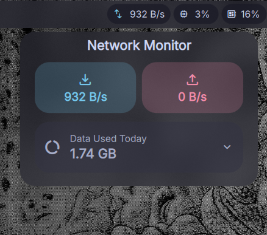
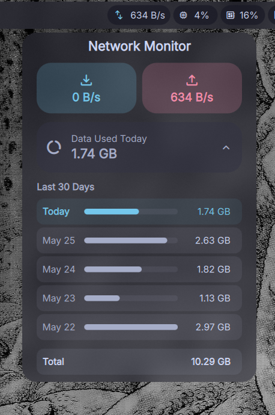

# 🌐 Network Indicator — DankBar Widget

A real-time network speed and data usage monitor plugin for [DankMaterialShell](https://danklinux.com/docs/dankmaterialshell/overview). It shows upload (↑) and download (↓) speeds directly in your DankBar, and automatically tracks your daily data usage!




## ✨ Features

- 📊 **Live upload & download speeds** right in your DankBar
- 📅 **30-day data usage history** — persistent across reboots
- 🔌 **Automatic offline detection** — shows when your connection drops
- ↕️ **Works in horizontal and vertical bars**
- ⚙️ **Configurable** — combined or separate speed readouts, adjustable units & polling rate
- 🪶 **Zero dependencies** — pure Linux, no extra packages needed

## 📦 Installation

### Option 1: DMS Plugin Manager (recommended)

1. Open **DMS Settings** → **Plugins**
2. Click **Browse** and search for **Network Indicator**
3. Click **Install**, then restart: `dms restart`

### Option 2: DMS CLI

```bash
dms plugins install network-indicator
dms restart
```

### Option 3: Manual (git clone)

```bash
cd ~/.config/DankMaterialShell/plugins
git clone https://github.com/gemb0-0/Network-Indicator.git "Network Indicator"
dms restart
```

### After installing

1. Open **DMS Settings → Plugins** and click **Scan for Plugins**
2. Toggle **Network Indicator** on
3. Add it to your **DankBar** widget list
4. Restart: `dms restart`

## 🎛️ Settings

| Setting | Description | Default |
|---------|-------------|---------|
| **Update Interval** | Polling frequency in seconds (e.g., `1` to `10`) | 2 sec |
| **Display Unit** | Auto / KB/s / MB/s | Auto |
| **Display Mode** | **Separate** (show ↑ and ↓) or **Combined** (single total speed) | Separate |

## 🛠️ How It Works

The plugin reads Linux's built-in network statistics — no external tools required.

| What | Source | Purpose |
|------|--------|---------|
| Byte counters | `/proc/net/dev` | Calculates upload/download speed deltas each poll |
| Link state | `/sys/class/net/*/operstate` | Detects online/offline instantly |
| Persistence | DMS Plugin State API | Saves daily usage across reboots (30-day rolling window) |

It automatically finds your active network interface, ignoring loopback and virtual interfaces (docker, veth, etc.).

## 📄 License

MIT
